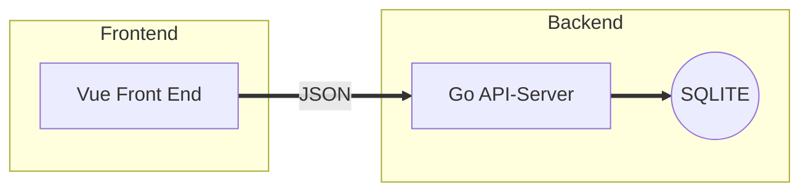

# TODO app
*Version:* **0.0.1**
A simple TODO app 
Create Users and create Tasks for each User

# Backend

Most basic Go-API-Server running on a sqlite database
Exposes endpoints for User and Task CRUD

**User**

    {	
        "id": 001,
        "name": "Jaaki",
    }

**Task**

    {	
        "id": 1234,
        "description": "Some Task description",
        "state": "to do", (to do / done)
        "user_id": 001
    }

**API Endpoints**
***Users***
 1. GET /users , return array of Users
 2. POST /user , update User if user.id is present, else new User is created 
 3. DELETE /user/:userid, delete the User with user.id

***Tasks***
 1. GET /tasks/:userid , return array of Tasks for User with userid 
 2. POST /task/:userid , update Task if task.id is present, else new Task is created for User with user.id
 3. DELETE /task/:userid/:taskid, delete the Task with task.id for User with user.id

## Architecture

## How To Run

Run this App by cloning the Repo to your local machine.

*Run the API-Server*

 1. Open a terminal and CD into the **./api_server** directory 
     - If you're using Linux, just execute the pre-built server by running **./api_server**
     - If your on MacOS or Windows, you'll have to compile the server, I'll add the pre built servers later
     - Install Golang first, then in this directory run "**go get .**" and the "**go run .**" (Notice the full-stops!)
		

*Run the Front-end*			

 2. Have Nodejs and NPM installed on your machine
 3. CD into the "**./frontend**" 
 4. Run "**npm install**"
 5. Run "**npm run dev**"

## Future Features

 - [ ] Rebuild Front-End to look super snazzy!
 - [ ] For Scaling the back-end, turn it into a Stateless Container and swap the sqlite for a database cluster
